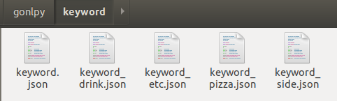
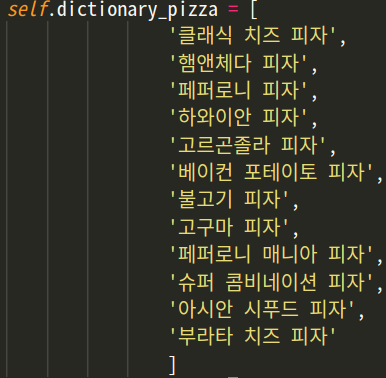

# GoNLpy
This repository include  Morpheme analyzer for gopizza

# Install KoNLPy
version == 0.4.3    
include == KoNLpy, Mecab    

# Why use Mecab
Loading time: Class loading time, including dictionary loads.    
Execution time: Time for executing the pos method for each class, with 100K characters.    
|Name | Loding time|Excution time|
|:---|---:|:---:|
|Kkma| 5.6988 secs|35.7163 secs|
|Komoran| 5.4866 secs|25.6008 secs|
|Hannanum| 0.6591 secs|8.8251 secs|
|Okt (previous Twitter)| 1.4870 secs|2.4714 secs|
|Mecab| **0.0007 secs**|**0.2838 secs**|


# Speed Our data
Test 100K iteration     
100%|██████████████████████████████████████| 2500/2500 [00:06<00:00, 364.12it/s]      
converter finished 6.885154724121094 sec     
Just 7 second used !!      

## MAC OS
1. install KoNLpy
```
pip install konlpy     # Python 2.x
pip3 install konlpy    # Python 3.x
```
2. install MeCab
```
bash <(curl -s https://raw.githubusercontent.com/konlpy/konlpy/master/scripts/mecab.sh)
```

## Ubuntu
1. install KoNLpy
```
sudo apt-get install g++ openjdk-7-jdk # Install Java 1.7+
sudo apt-get install python-dev; pip install konlpy     # Python 2.x
sudo apt-get install python3-dev; pip3 install konlpy   # Python 3.x
```
2. install MeCab
```
sudo apt-get install curl
bash <(curl -s https://raw.githubusercontent.com/konlpy/konlpy/master/scripts/mecab.sh)
```

# Use this code
Cloning this repository    
```
git clone https://github.com/Keunyoung-Jung/gonlpy.git
```
Copy `gonlpy.py`file and `keyword`folder to the folder you want to use.

example code
```
converter = NameConverter()
output = converter.convert('청포도 에이드')
print(output)
```
>> 청포도 에이드 음료

# Modify keyword
If you want to modify keyword,     
go `keyword`folder and Modify `json`file


# Add Menu
If you want to add menu,     
open `gonlpy.py`file and Add menu name to `dictionary`array


# Reference
https://konlpy.org/en/latest/
